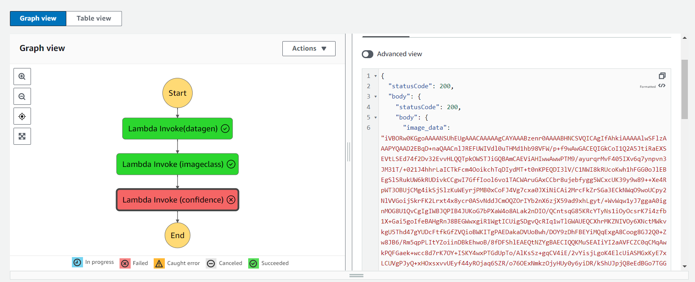

# Project: Build a ML Workflow For Scones Unlimited On Amazon SageMaker

*Introduction*

Image Classifiers are used in the field of computer vision to identify the content of an image and it is used across a broad variety of industries, from advanced technologies like autonomous vehicles and augmented reality, to eCommerce platforms, and even in diagnostic medicine.

You are hired as a Machine Learning Engineer for a scone-delivery-focused logistics company, Scones Unlimited, and you’re working to ship an Image Classification model. The image classification model can help the team in a variety of ways in their operating environment: 

1. *Detecting people and vehicles in video feeds from roadways*
2. *It can better support routing for their engagement on social media*
3. *Detecting defects in their scones, and many more!*

In this project, you'll be building an image classification model that can automatically detect which kind of vehicle delivery drivers have, in order to route them to the correct loading bay and orders. Assigning delivery professionals who have a bicycle to nearby orders and giving motorcyclists orders that are farther can help Scones Unlimited optimize their operations.

As an MLE, your goal is to ship a scalable and safe model. Once your model becomes available to other teams on-demand, it’s important that your model can scale to meet demand, and that safeguards are in place to monitor and control for drift or degraded performance.

## Project Steps Overview

1. Data Staging
   
In this step we first extract the data from the hosting service. Once the data is downloaded, you will explore it and transform it into the correct shape and format. Finally, you will load the data to S3.
We'll use a sample dataset called CIFAR to simulate the challenges Scones Unlimited is facing in Image Classification. In order to start working with CIFAR, we'll need to:
   -Extract the data from a hosting service
   -Transform it into a usable shape and format
   -Load it into a production system
   
2. Model Training and Deployment
   
In this stage we use a AWS build-in image classification algorithm to train the model. Once the model is successfully trained, it is deployed to an endpoint and we configure Model Monitor to track the deployment. At the end, you will make an inference to test the model endpoint.

3. Lambdas and Step Function Workflow
   
Here we write and deploy three Lambda functions, and then use the Step Functions visual editor to chain them together!
The first lambda function is responsible for *data generation*. The second one is responsible for *image classification*. And the third function is responsible for *filtering out low-confidence inferences*.

4. Testing and Evaluation
   
In this step, we first perform several step function invokations using data from the test dataset. This process should give you confidence that the workflow both succeeds AND fails as expected. In addition, you will use the captured data from SageMaker Model Monitor to create a visualization to monitor the model.

## Dataset
The CIFAR dataset is open source and generously hosted by the University of Toronto at: https://www.cs.toronto.edu/~kriz/cifar-100-python.tar.gz.
